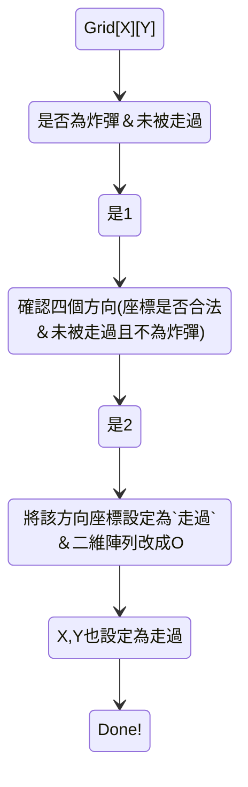

# The Bomberman Game

## [題目連結](https://www.hackerrank.com/challenges/one-month-preparation-kit-bomber-man/problem?h_l=interview&isFullScreen=true&playlist_slugs%5B%5D%5B%5D=preparation-kits&playlist_slugs%5B%5D%5B%5D=one-month-preparation-kit&playlist_slugs%5B%5D%5B%5D=one-month-week-three)

前言
---
- 主要是針對二維陣列的理解以及條件思考
- 這題需要會一點recursion（如果有需要的話，我是沒用上，怕弄巧成拙），不會的話也沒關係
- 題目要我們將炸彈客放置炸彈的範圍（為一個二維陣列），將該秒數的二維陣列顯示出來，動作包括等待、放置炸彈、炸彈爆炸、未放置任何炸彈...這些都會在技巧加強解釋

技巧
---
- 我們先將題目給的條件列出來
1. 一開始題目會給一個二維陣列(存於vector)，以及一個n(秒數)，目的就是要我們算出n秒時，二維陣列應該為什麽圖形
2. 題目說初始狀態為0秒時，炸彈客會在二維陣列上放上炸彈。 => n=0 return 二維陣列
3. 下一秒，炸彈客不做任何事。 => n=1 return 二維陣列
4. 再下一秒，炸彈客將所有假炸彈鋪滿整個二維陣列。 => n=2 return 鋪滿炸彈的二維陣列
5. 再下一秒，炸彈爆炸，真的炸彈會波及到他上下左右的炸彈，假炸彈則不會爆炸。 => n=3 return 爆炸後的二維陣列
6. 再下一秒，炸彈客替換掉剩餘在場的假炸彈為真炸彈，並重新用假炸彈鋪滿整個二維陣列。 => n=4 return 鋪滿炸彈的二維陣列
7. 再下一秒，炸彈爆炸，留下在場的假炸彈。 => n=5 return 爆炸後的二維陣列

- 好，事情變得有點複雜了，以下主要解決`n>=3 且 n不為2的倍數`的解答
- `n=3`示意圖

- 我的方法是把原本的圖存起來，利用複製的圖(目的是確認這裡是否被走過，原因寫在疑問)，然後只要有走過的地方，就不會再走一次，所以目前我的時間複雜度是Ｏ(n * m)，跑兩個迴圈去一個一個走過每個元素。
- 一開始只有遇到‘Ｘ’，於是我很快樂的先將他們都設定為已走過並改成’Ｏ‘，一切都很順利直到遇到了‘Ｏ’，對，他是炸彈，照理來說應該炸掉上下左右的假炸彈，於是我確認每個方位一次，總共四次，確認是否被走過，我發現上面跟左邊被走過的地方因為已經被列為走過，所以會被跳過沒被炸到。
- 我絞盡腦汁後想到，為什麼不將他以相反的方式去存，我不需要看到’Ｘ‘就存成’Ｏ‘，我是先確認每個炸彈的位置，找到他的鄰居，並將其同化成’Ｏ‘，最後再把’Ｘ‘替換成’Ｏ‘、’Ｏ‘替換成’Ｘ‘就好啦～
- 大致上是這樣的：

- 最後再將成品整個替換過一輪就可以得到`n=3`的答案了
- `n=5`示意圖

- 是否覺得是曾相識？
- 沒錯就是n=3爆炸前的grid印上去就是了，no！如果你這麼想就掉入陷阱了，並不是所有題目都那麼剛好，就把剛才得到的結果，乖乖放近自己的bomberman吧～

最後總結一下我如何判斷`n>=3`的情況
- 已知 3 7 11...為同一種結果
- 已知 5 9 13...為同一種結果
- 這兩個數列都是等差數列，且這裡一定只會出現`n>=3`的數字，所以我將每個n-3，得到的數列為下：
- 0 4 8...
- 2 6 10...
- 雖然兩者都還是等差數列，但我可以說誰沒辦法被4整除的，就是需要回傳 bomberman(n-2, grid)，如此一來，再次判斷到的時候 n 就會直接回傳了

疑問
---
>**問：為什麼最後5 9 13...要回傳 n-2 的結果？**
>>答：因為兩種陣列等差2，所以只要n-2就可以直接回傳答案，兩者只差在是否需要多走一次 bomberman 而已。

